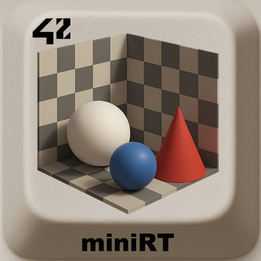
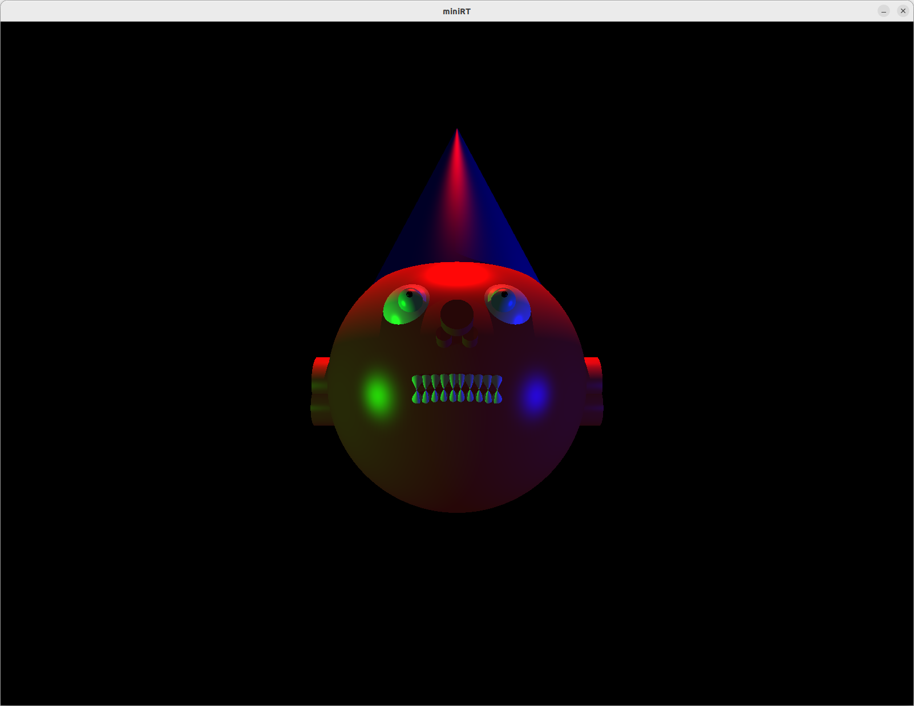
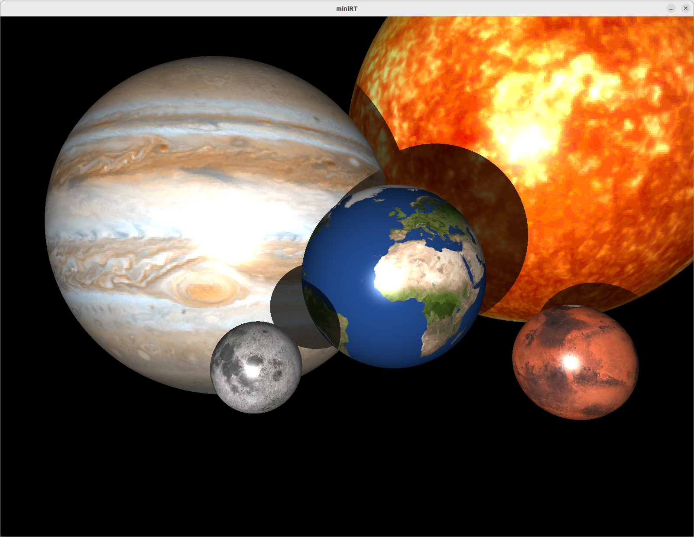
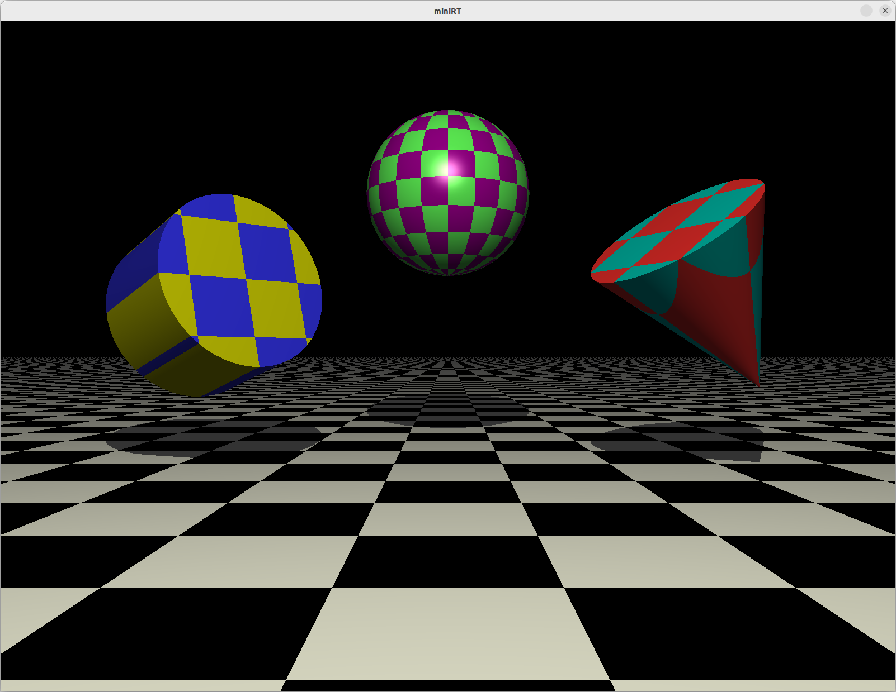
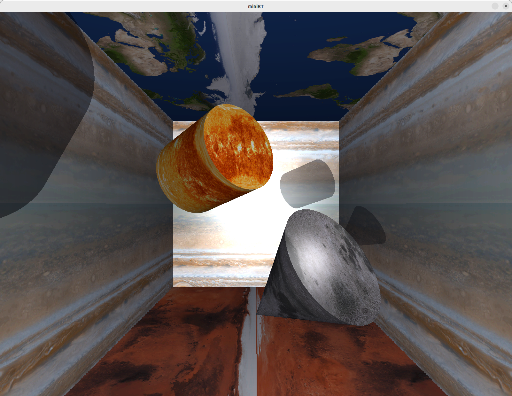
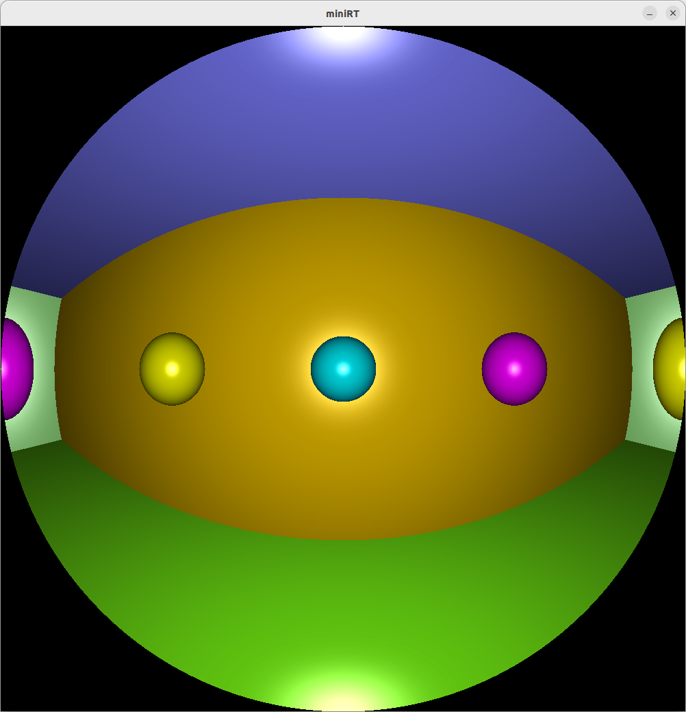
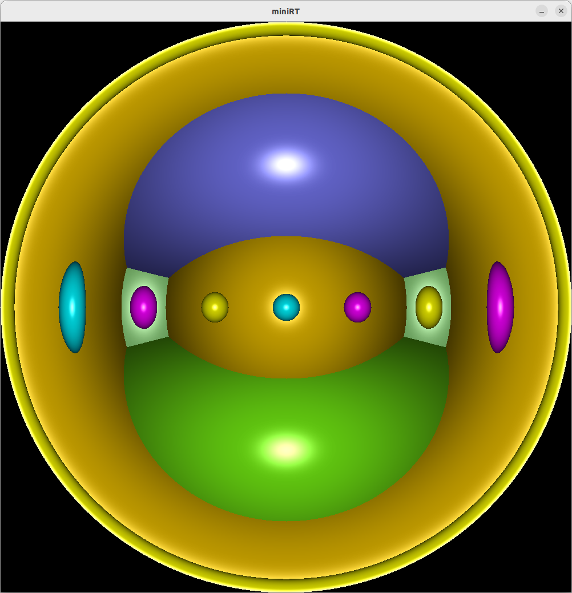
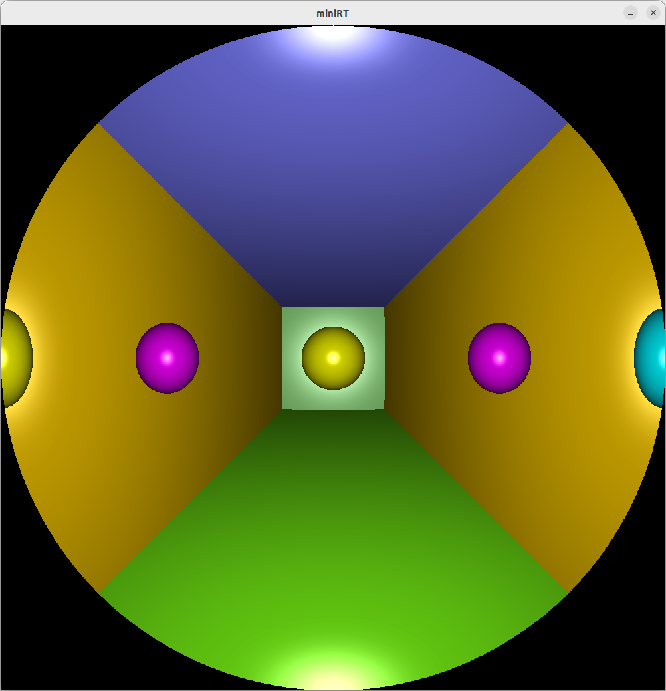

<div align="center">
  <h2>miniRT – 42 project RayTracer</h2>
  
  <br>
</div>


> **miniRT** is a basic **raytracer** implemented in C with **MiniLibX**.  
> It renders simple 3D scenes with lighting and shadows.

---

## 📖 Table of Contents
- [Description](#-description)
- [Features](#-features)
- [Installation](#-installation)
- [Usage](#-usage)
- [Examples](#-examples)
- [Roadmap](#-roadmap)
- [Credits](#-credits)
- [License](#-license)

---

## 📝 Description
The project introduces the principles of **ray tracing**:  
- Ray-object intersections  
- Camera setup and projection  
- Light sources and shadows  
- Basic shading (Phong)  

---

## ✨ Features
- ✅ Render spheres, planes, cylinders and cones.  
- ✅ Point and directional light source.
- ✅ Render cones (bonus).
- ✅ Point and directional multiple light sources (bonus).
- ✅ Phong shading model(bonus).
- ✅ Render textures (bonus).
- ✅ Scene description file (`.rt`).
- ✅ Fisheye mode(extra).

---

## ⚙️ Installation
Requirements:  
- Linux
- `make` and `gcc`/`clang`
- MiniLibX for Linux needs the dependencies `xorg`, `libxext-dev` and `zlib1g-dev`.

if needed you can install the MinilibX depencies with:
```bash
sudo apt-get update && sudo apt-get install xorg libxext-dev zlib1g-dev libbsd-dev
```
Then:
```bash
git clone https://github.com/LogUmi/miniRT.git
cd miniRT
make
```
This will generate an excutable miniRT.

```bash
make bonus
```
This will generate an excutable miniRT_bonus.

---

## 🖥 Usage
```bash
./miniRT scenes/<directory path>/<scene name.rt>
```

## 📂 Project Structure

```
.
├── img/                	# Content for README
├── includes/
│	├── bonus/				# Bonus header files (.h)
│	└──mandatory/			# Mandatory header files (.h)
├── libft/					# Authorized functions
├── maps/
│	├── bonus_scenes/		# Bonus map files
│	│	└──fisheye/			# specific map for fisheye mode (auto)
│	├── images/				# Texture images
│	├── mandatory_scenes/	# Mandatory map files
│	└── test_w_errors/		# Maps for error testing
├── mlx_linux/				# MiniLibX library
├── srcs/
│	├── bonus/				# Bonus source files (.c)
│	└──mandatory/			# Mandatory source files (.c)
├── fr.subjectFdF.pdf		# Project subject
├── LICENSE			   		# License MIT
├── Makefile
└── README.md
```

---

## 🔎 Examples
TO COMPLETE

```bash
$ ./miniRT_bonus scenes/bonus_scenes/head0.rt 
Scene scenes/bonus_scenes/head0.rt: file opened
Minilibx library initialized
Screen 1920x1200 detected
New window 1000x1000 opened
Image 1600x1200 out of window range
New image 1000x1000 created
Ligne générer 0/1000
Ligne générer 50/1000
Ligne générer 100/1000
Ligne générer 150/1000
Ligne générer 200/1000
Ligne générer 250/1000
Ligne générer 300/1000
Ligne générer 350/1000
Ligne générer 400/1000
Ligne générer 450/1000
Ligne générer 500/1000
Ligne générer 550/1000
Ligne générer 600/1000
Ligne générer 650/1000
Ligne générer 700/1000
Ligne générer 750/1000
Ligne générer 800/1000
Ligne générer 850/1000
Ligne générer 900/1000
Ligne générer 950/1000


```bash
Regular end of session on esc key press
```
Other screen outputs:







Fisheye mode rendering:






---

## 🚀 Roadmap
This project is the original version that was evaluated at 42 and will remain in this state.

---

## 👤 Credits
Project developed by :
- **Loïc Gérard** – 📧 Contact: lgerard@studend.42perpignan.fr - [École 42 Perpignan](https://42perpignan.fr).
- [**sos-sudo**](https://github.com/sos-sudo).

---

## 📜 License
This repository contains code under two different licenses:
- The project code (FdF, MiniRT, etc.) is released under the MIT License.
- The included MiniLibX library is released under the BSD License (© Olivier Crouzet, 1999–2015).
Both licenses are provided in the [LICENSE](./LICENSE) file of this repository.

> ⚠️ **Note for students**  
> If you are a student at 42 (or elsewhere), it is strongly recommended **not to copy/paste** this code.  
> Instead, try to **write your own solution** — it’s the only way to really learn and succeed.
